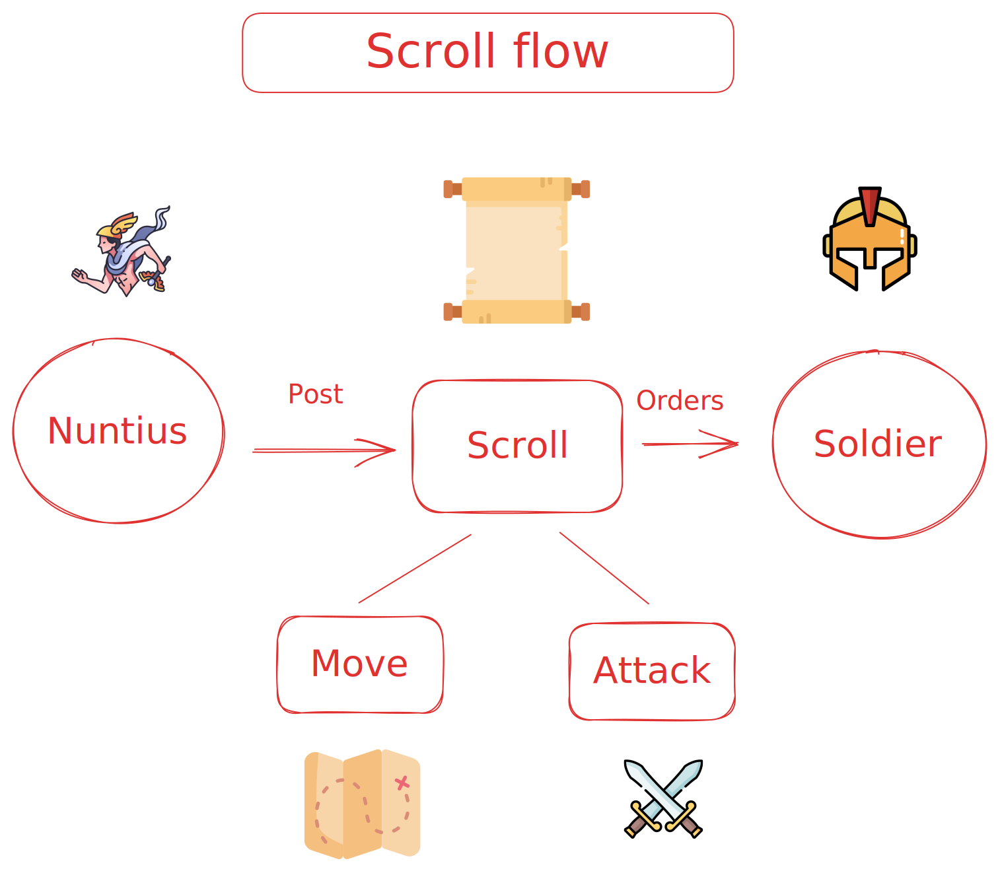
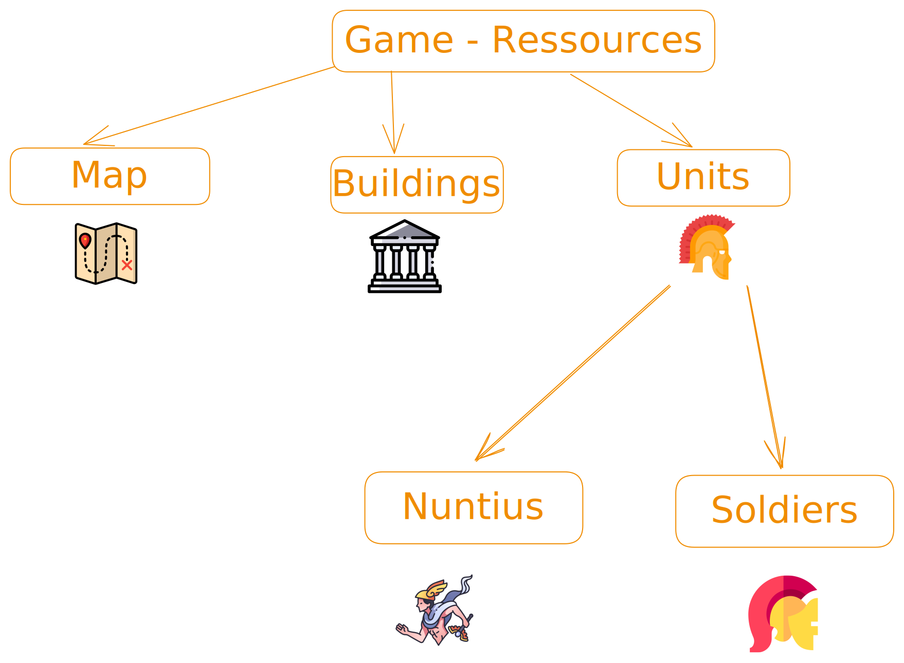
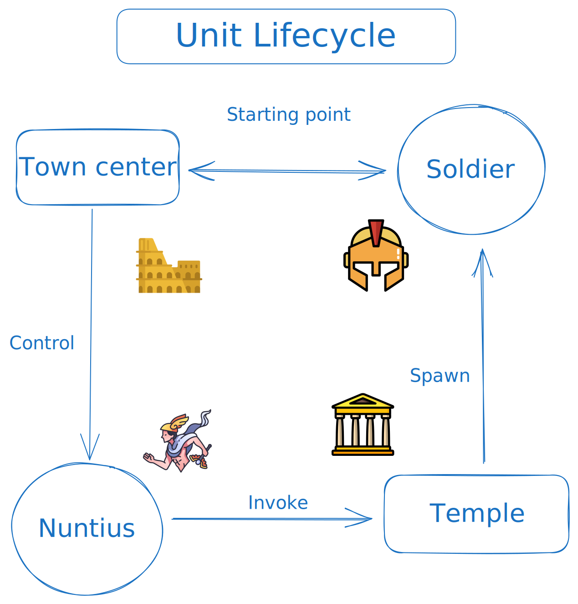

# Vox Nuntius

## Setup

You should have rust installed and clone this repository. Then, to build the rust-lib, in the root folder, run:

```bash
git submodule update --init --recursive
```

Finally, run in the rust-lib folder:

```bash
cargo build
```

## Game Specifications

### Overview

This is a RTS game. There is a solo campaign played against an AI.
This game is based on the concept that orders and information take some time to propagate. The player sould take the travel time into account when making strategy decisions.



### Buildings

- Temple: there is only one on the map, in the middle. This building is indestructible. Both the player and the AI can invoke new units by sending a nuntius there. Each player has a number of points available at the start of the game, and can only invoke units in that limit.
- Town Center: your center is your base, has 1000 Health Points, and represent the winning condition of the game. Destroy the ennemy's Town center to become the master of Vox Nuntius. Alternatively, you also win by eliminating all of your opponent's units.



### Units

- Nuntius: this unit is responsible to carry order accross the map to your units. Each player has a set number of nuntius and can lose some to combat action. Be careful with your nuntius, they have 100 health points and you won't get more nuntius as the game goes on. Once a nuntius is sent on a mission to carry orders, the player can not control it until the mission is completed. Their movement speed is 2 speed unit.
- Soldiers: they are your attack unit, they have 100 health points and you can make some spawn by sending a nuntius to the temple at the center of the map. Their movement speed is 1 speed unit and when they are not given orders they attack any unit (choosen at random) among those in range.



### Map

The map has a width of 160 unit wide and a height of 90 units. Apart from the normal terrain, there is also some terrain that is impassable.
